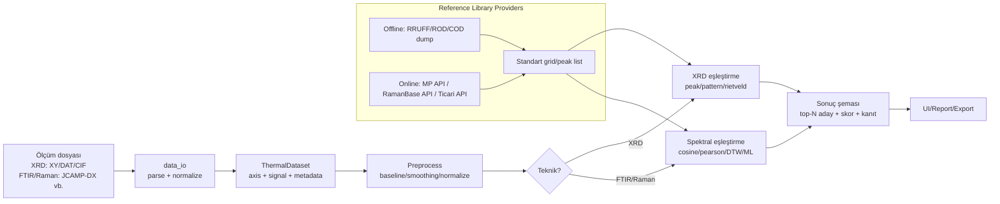

# Thermoanalyzer Projesine XRD, FTIR ve Raman Malzeme Eşleştirme Kütüphaneleri Entegrasyonu

## Yönetici özeti

Bu çalışma, `thermoanalyzer` (Streamlit/FastAPI tabanlı) projesine XRD–FTIR–Raman “malzeme eşleştirme” (measured → candidate materials) altyapısı eklemek için kullanılabilecek **ücretsiz/açık** ve **ticari/kurumsal** veri tabanları, kütüphaneler ve API’lerin kapsamlı bir karşılaştırmasını sunar. Proje tarafında kritik gözlem: repo zaten **FTIR, RAMAN ve XRD analiz tiplerini “stable adapter”** yaklaşımıyla `execute_batch_template` üzerinden çalıştıracak şekilde kurgulanmış durumda. Bu, yeni eşleştirme kabiliyetlerini eklemenin en doğal yolunun (i) **referans kütüphanelerini** projeye “provider” olarak dahil etmek ve (ii) sonuçları mevcut çıktı şemasına yedirmek olduğunu gösterir. citeturn33view4turn6view2

Mevcut veri içe aktarma katmanı, özellikle **JCAMP-DX (FTIR/Raman)** için yerleşik bir yol ve **XRD ölçüm desenleri** için (.xy/.dat gibi) ayrı bir yol içeriyor; ayrıca XRD için **ölçülmüş powder pattern içeren CIF** türünü desteklemeye odaklanmış bir CIF içe aktarımı da bulunuyor. Bu; açık veri tabanlarının (COD gibi) çoğunlukla **yapısal CIF** vermesi nedeniyle XRD tarafında “yapıdan desen simülasyonu → eşleştirme” adımını pratikte zorunlu kılar. citeturn33view2turn33view3

Üç kullanım senaryosu için önerilen “en iyi” setler:

(A) **Tamamen ücretsiz/açık ve offline**:  
**XRD** için COD (CC0) + `pymatgen` ile CIF→XRD simülasyonu + (isteğe bağlı) GSAS-II/XERUS ile hızlı Rietveld doğrulaması; **Raman/IR** için RRUFF (ZIP ile offline) + ROD (CC0) + yerel benzerlik araması. COD verisinin kamu malı/CC0 olması ve RRUFF’un (Raman/IR/XRD) ZIP olarak indirilebilir olması offline kütüphane kurulumunu mümkün kılar. citeturn11search8turn11search0turn17view2turn32search1turn32search0turn12search1turn12search6turn16view0turn35search0turn35search3

(B) **Hibrit (açık veri + ücretli API/DB) ile en yüksek doğruluk**:  
XRD’de **ICDD PDF (PDF-4/PDF-5)** gibi kalite kontrollü veri tabanları + (organik/MOF vb. için) CSD/ICSD gibi yapısal kaynaklar; FTIR’de **NIST/EPA Gas-Phase IR (JCAMP)** gibi lisanslı koleksiyonlar; Raman’da **Raman Base Public API** ile güncel çevrimiçi tarama. Bu kombinasyon, açık verinin kapsamadığı “endüstriyel kritik” alanlarda doğruluk ve kapsamı artırır. citeturn25search12turn25search22turn24search24turn30view0turn32search14turn27search7turn27search1turn27search20

(C) **Kurumsal/enterprise entegrasyon**:  
XRD için **HighScore (Plus)** veya **MDI JADE Pro** gibi endüstri standardı search/match + (gerekiyorsa) Rietveld otomasyonu; FTIR/Raman için **ACD/Labs Spectrus + FDM/NIST gibi ticari spektral kütüphaneler**; Raman tarafında ayrıca SpectraBase gibi abonelikli çevrimiçi kaynaklar. Kurumsal senaryoda pratik yaklaşım, bu yazılımları “dış motor” olarak CLI/otomasyon ile çalıştırıp sonuçları repo içine standart bir JSON şema ile almak olur. citeturn25search1turn25search13turn25search2turn25search11turn25search3turn25search7turn25search14

Belirsiz bırakılan gereksinimler: hedef OS (Windows/Linux/macOS), beklenen throughput (günlük kaç spektrum/desen), çevrimdışı disk limiti, hedef sektör (mineral/organik/polimer/ilaç vb.) kullanıcı tarafından belirtilmemiştir (bu raporda **unspecified** kabul edilmiştir).

## Mevcut repo mimarisi ve entegrasyon noktaları

Repo; “modality” kavramını bir kayıt/registry ile yönetiyor ve FTIR/RAMAN/XRD dahil farklı analiz tiplerini **StableBatchAdapter** ile `execute_batch_template` üzerinden çalıştıracak biçimde sarmallıyor. Bu, yeni eşleştirme kütüphanelerini entegre etmenin iki ana yolu olduğunu gösterir:  
(i) `execute_batch_template`’e giden **processing/method_context** içine yeni eşleştirme motorunun parametrelerini taşımak, (ii) dataset metadata içine **referans kütüphane** enjekte etmek (kütüphane provider’ı repo içinde). citeturn33view4turn6view2

Veri giriş katmanı (içe aktarma):

- **FTIR/Raman**: JCAMP-DX uzantıları için içe aktarma yolu tanımlı; “tek spektrum” MVP kısıtları olduğuna dair korumalar var (multi-block/peak-table vb. destek dışı). citeturn33view2  
- **XRD**: .xy/.dat gibi ölçüm desenleri için içe aktarma; ayrıca ölçülmüş powder pattern loop’ları içeren CIF için ayrı bir mantık mevcut. Yapısal CIF (atom koordinatları) odaklı dosyaların bu MVP kapsamının dışında bırakıldığına dair ipuçları bulunuyor. citeturn33view3

Aşağıdaki mermaid diyagramı, repo içerisinde önerilen “kütüphane sağlayıcı (provider)” yaklaşımıyla uçtan uca akışı gösterir:



Bu desen, repo tarafında “eşleştirme motoru”nu tek bir yere gömmek yerine, **referans veri kaynaklarını modülerleştirerek** (offline/online/ticari) sürdürülebilir bir mimari sağlayacaktır.

## Aday kütüphaneler, veri tabanları ve API’ler

### Açık/ücretsiz kaynaklar

**COD (Crystallography Open Database)**:  
COD, CIF tabanlı kristal yapı koleksiyonudur; kamu malı/CC0 olarak sunulur ve yüz binlerce giriş içerir. citeturn11search8turn11search4 COD için REST erişimi dokümante edilmiştir; örneğin bir kaydı `.cif` uzantısıyla indirme yaklaşımı açıkça anlatılır. citeturn11search0turn11search36  
Uygulamada COD, XRD search/match için doğrudan “referans desen” değil, **referans yapı** sağlar; bu yüzden projeye entegrasyonda tipik strateji `pymatgen` ile CIF→XRD simülasyonu üretip sonra eşleştirmedir (aşağıdaki senaryolarda kod örneği verildi). citeturn35search0turn35search3

**RRUFF (mineraller için Raman/IR/XRD)**:  
RRUFF, Raman, infrared ve powder XRD dahil çeşitli mineral verilerini barındırır; “Download data” sayfası RRUFF ve AMCSD veri dosyalarının ZIP olarak indirilebildiğini ve Raman/Infrared/Powder XRD koleksiyonlarını ayrı ayrı verdiğini belirtir. citeturn17view2turn18search2  
Not: Eski RRUFF sitedeki bazı içerikler (özellikle PDF makaleler) “kişisel eğitim amaçlı” gibi kısıtlarla sunulmuştur; yeniden yayın/redistribution için yayıncıya yönlendirme yapılır. Bu, spektrum verileriyle karıştırılmamalı; ama kurumsal kullanımda hukuk kontrolü gerektiren bir sinyal olarak değerlendirilmelidir. citeturn21view0

**ROD (Raman Open Database)**:  
ROD, SOLSA H2020 bağlamında sunulan açık Raman spektrum koleksiyonudur; verinin kamu malı/CC0 olduğu ve yaklaşık bin civarında kayıt bulunduğu belirtilir. citeturn32search0turn32search1  
ROD’nin güçlü yanı: açık lisans + indirilebilir kayıtlar; zayıf yanı: kapsamın (şimdilik) RRUFF/ICDD gibi dev datasetlere kıyasla daha küçük olmasıdır. citeturn32search1

**Raman Base (çevrimiçi + Public API)**:  
Raman Base, “published Raman spectra” için Public API erişimi sunduğunu belirtir. citeturn32search14turn32search4 “Terms of Use” metninde; kayıtlı kullanıcıların benzerlik araması yapabildiği, public verinin araştırma amaçlı kullanılabildiği, DOI’siz public spektrumların **CC BY 4.0** kapsamında değerlendirildiği ve ticari/monetary-gain kullanımda ücret pazarlığı olabileceği yazılıdır. citeturn30view0 Raman Base ayrıca standart formatlar olarak `.txt, .csv, .jdx, .nxs` gibi formatları desteklediğini ifade eder. citeturn28search19  
Bu, (B) hibrit senaryoda “online Raman eşleştirme” için güçlü bir aday yapar.

**Materials Project API (hesaplamalı yapı/veri; XRD simülasyonu için çok faydalı)**:  
Materials Project, REST tabanlı Materials API sağlayan bir platformdur. citeturn11search6 “Tips for large downloads” dokümanı, API’nin 25 istek/saniye civarında rate limit uyguladığını belirtir. citeturn11search22 Terms of Use tarafında web scraping yapılmaması ve büyük veri çekimlerinin API üzerinden yapılması gibi beklentiler vurgulanır. citeturn11search2  
MP’den gelen yapılar, `pymatgen` ile XRD desen simülasyonuna dönüştürülebilir; `pymatgen.analysis.diffraction.xrd` modülü XRDCalculator mantığını barındırır ve MIT lisansına atıf yapılır. citeturn35search0turn35search3

**SpectroChemPy (Python, spektral veri işleme/kemometri)**:  
SpectroChemPy; FTIR/Raman dahil spektroskopik veriyi işlemek/modellemek için Python çerçevesidir; GitHub özetinde çapraz platform olduğu ve lisansının **CeCILL-B** olduğu görülür. citeturn12search0turn13view2 Bu kütüphane doğrudan “hazır kütüphane search/match” ürünü olmaktan çok, **çoklu ön-işleme + kemometrik modelleme** için güçlüdür (ör. PCA/PLS vb. yetenekleri belirtilir). citeturn12search0turn12search4

**RamanSPy + format okuyucular (Python)**:  
RamanSPy; Renishaw `.wdf` gibi ticari cihaz çıktılarının yüklenebildiğini dokümante eder. citeturn12search11 Ayrıca RRUFF verisinin kolay indirilebildiğine dair “RRUFF dataset loader” anlatımı bulunur. citeturn18search16  
Format okuma tarafında `renishaw-wdf` paketi `.wdf` dosyaları için Python desteği sağladığını ve Python 3.8+ istediğini belirtir. citeturn13view3 RosettaSciIO (HyperSpy ekosistemi) de Renishaw `.wdf` okuyabildiğini açıkça yazar. citeturn12search31

**GSAS-II + XERUS (Python; XRD Rietveld/doğrulama)**:  
GSAS-II; Python tabanlı kapsamlı XRD (tek kristal/powder vb.) analiz paketidir ve Rietveld analizini de kapsar. citeturn12search1turn12search5 Scriptable modül üzerinden Python ile otomasyon eğitimleri bulunur. citeturn12search21  
XERUS; GSAS-II Scriptable üstüne kurulu açık kaynak bir Python aracı olarak, benzerlik hesaplarını “hızlı Rietveld” ile birleştirerek faz tanımlama/iyileştirme otomasyonu vaat eder; MIT lisanslıdır ve akıllı bir “açık DB’lerden yapı çek → simüle et → benzerlik + refinement” yaklaşımı sunar. citeturn12search2turn12search6turn16view0

### Ticari/kurumsal kaynaklar

**ICDD Powder Diffraction File (PDF-2/PDF-4/PDF-5 vb.)**:  
ICDD, Powder Diffraction File ürünlerinin “licensed, copyrighted databases” olduğunu ve lisans satın alma süreçlerini açıkça belirtir. citeturn25search12turn25search18 ICDD 2026 ürün özetinde PDF® Release 2026’nın **1,126,213** malzeme veri seti içerdiği ifade edilir. citeturn25search22 PDF-4/Minerals sayfası ise 2026 sürümünde 54,900+ giriş ve IMA’ya göre tanımlı mineral türlerinin %97’sini kapsama iddiasını vurgular. citeturn25search5  
Avantaj: endüstri standardı, kalite kontrol/derin meta-veri. Dezavantaj: lisans/kurulum (dongle, tek PC kısıtı vb.) ve maliyet.

**Malvern Panalytical HighScore (Plus)**:  
HighScore (Plus), “one mouse-click” ile otomatik faz tanımlama raporlama gibi otomasyon özelliklerini ve komut satırı üzerinden ilerletilebilen otomatik işlem (Automatic Processing Program/CLI) kabiliyetini belirtir. citeturn25search1turn27search25 HighScore Base ürün açıklaması; yazılımın yıllık abonelik içerdiğini ve faz tanımlama için ICDD PDF2/PDF4 veya ücretsiz COD gibi bir referans DB gerektiğini söylüyor. citeturn25search19turn25search35  
Türkçe kaynak olarak, bazı üniversite dokümanlarında HighScore Plus kullanımına dair pratik yönergeler bulunur (resmi ürün dokümanı yerine yerel eğitim notu niteliğindedir). citeturn26search4

**MDI JADE Pro (+ ICDD bundle)**:  
ICDD’nin JADE Pro bundle sayfası; JADE Pro’nun “Whole Pattern Based Search/Match”, vendor pattern okuma, simülasyon ve sınırsız fazlı WPF-Rietveld refinement gibi kapsamlı özelliklerini listeler ve “one year license serviced by subscription” gibi ticari lisans yaklaşımını belirtir. citeturn25search2turn25search10  
Maliyet konusunda resmî liste fiyatlar çoğu zaman teklif usulü olsa da, bir üniversite ders notu örneği Jade+ için ~5000$ ve ICDD CD-ROM DB için 3000–7000$ aralığında bir örnek maliyet verir (bu tür sayılar “yaklaşık ve tarih/kuruma göre değişken” kabul edilmelidir). citeturn25search24

**CSD (Cambridge Structural Database) + CSD Python API**:  
CCDC, CSD veri/yazılımını kullanmak için lisans gerektiğini açıkça yazar. citeturn27search7 CSD Python API dokümantasyonu programatik erişimi tarif eder. citeturn27search0turn27search3 CCDC ayrıca HighScore ile CSD entegrasyonuyla organik/MOF faz tanımlamanın kolaylaştığını anlatır. citeturn27search2turn27search29  
Bu, XRD tarafında “yapısal veri tabanı + desen simülasyonu + search/match” yaklaşımını kurumsal kalitede güçlendirir.

**ICSD (FIZ Karlsruhe / NIST ICSD)**:  
FIZ Karlsruhe, ICSD’nin dünyanın en büyük inorganik kristal yapı DB’lerinden biri olduğunu ve API ile veri madenciliği gibi kullanım hedeflediğini belirtir; ICSD içinde 290,000+ yapı ifadesi de geçer. citeturn27search34turn27search9 ICSD “API Service” gibi yüksek hacimli erişim senaryolarına yönelik ürün var ve lisans/koşullara dikkat çekilir. citeturn27search1turn27search20  
NIST tarafında da ICSD erişiminin abonelik gerektirdiği belirtilir. citeturn27search4

**NIST WebBook ve NIST lisanslı IR koleksiyonları**:  
NIST Chemistry WebBook, IR spektrumları gibi içerikleri sunar ve sayfa altlarında telif/Standard Reference Data Act vurguları bulunur. citeturn24search0turn24search4 Bazı NIST sayfalarında spektrumun **JCAMP-DX indirimi** opsiyonu görülebilir. citeturn24search31  
Buna ek olarak NIST Shop, **NIST/EPA Gas-Phase Infrared Database (JCAMP)** ürününün ücretli lisansla sunulduğunu ve 5,228 IR spektrumu içerdiğini belirtir. citeturn24search24

**IRUG (cultural heritage odaklı IR/Raman)**:  
IRUG; IR ve Raman referans spektrumları geliştirip peer-review süreçleriyle yayımlar. Ziyaretçiler spektrumları görüntüleyebilir/çıktı alabilir; ancak “digital spectra ve ilgili bilgiye erişim” için üye olup spektrum katkısı istenir. citeturn24search2turn24search9 Arama sayfası; arama yaparak “Terms of Use/Legal Conditions” kabul edildiğini ve spektrum/veritabanının nasıl cite edilmesi gerektiğini vurgular. citeturn24search17

**AIST SDBS (organik bileşikler için IR/Raman vb.)**:  
SDBS, ücretsiz erişim sağlasa da robotlarla otomatik veri toplama veya büyük miktarda indirmeyi yasakladığını belirtir. citeturn24search3 Bu nedenle SDBS, üretim entegrasyonunda “bulk offline library” kurmak için hukuken ve operasyonel olarak zorludur; daha çok manuel referans kontrolü/araştırma amaçlı düşünülmelidir.

**ACD/Labs Spectrus + FDM/NIST vb. kütüphaneler**:  
ACD/Labs Spectrus, IR ve Raman dahil çok teknikli bir platformdur ve 150+ veri formatını (JCAMP gibi standartları dahil) “native support” ile desteklediğini belirtir. citeturn25search11turn25search29 IR/Raman kütüphaneleri sayfası, FDM ve NIST gibi ticari veri tabanlarının Spectrus içinde aranabildiğini söyler. citeturn25search3  
FDM tarafı, kütüphane ve yazılımlarını “one-time license fee veya subscription” ile sunduğunu ifade eder. citeturn25search7

**SpectraBase (çevrimiçi spektral DB)**:  
SpectraBase, IR/Raman dahil “milyonlarca spektrum” erişimi iddiasıyla çevrimiçi çalışır; kayıtlı kullanıcıya 5 ücretsiz spektrum görüntüleme ve sonrası abonelik planları olduğunu belirtir. citeturn25search14  

## En güçlü adayların karşılaştırma tablosu

Aşağıdaki tablo, pratik entegrasyon açısından en sık tercih edilen adayları özetler. (OS/hedef throughput **unspecified** olduğu için performans değerlendirmeleri “tipik kurulum” varsayımıyla nitel verilmiştir.)

| Aday | Teknikler | Girdi/Çıktı & Formatlar | Dil/Bağlayıcı | Lisans/Maliyet | API & Limit | Kapsam (kanıt) | Offline/Online | Repo entegrasyon notu | Bilinen sınırlamalar |
|---|---|---|---|---|---|---|---|---|---|
| COD | XRD (yapı) | CIF indirme + REST erişim | Çoklu; Python tarafında `pymatgen` ile kullanılır | CC0/kamu malı (ücretsiz) citeturn11search8 | REST var (limit belirtilmemiş) citeturn11search0 | ~532k+ giriş (mirror ifadesi) citeturn11search4 | Offline dump mümkün + online erişim | CIF→XRD simülasyonu üretip internal eşleştirmeye besle | Yapısal CIF çoğunluk; ölçüm deseni değil → simülasyon şart |
| Materials Project API | XRD (yapı), hesaplamalı veri | REST API; Python mp-api | Python (mp-api) citeturn11search6turn11search14 | Üyelik/anahtar; şartlar/atıf citeturn11search2 | Rate limit ~25 istek/sn citeturn11search22 | Çok geniş (boyut sayı vermiyor) | Online | MP→Structure→`pymatgen` XRDCalculator ile simüle → eşleştir citeturn35search0turn35search3 | Online bağımlılık; scraping yasak; hız limitine uymak gerekir |
| RRUFF | Raman + IR + Powder XRD | ZIP ile .txt vb. koleksiyonlar citeturn17view2 | Her dil; Python ile kolay parse | Ücretsiz indirme; bazı içerikler “kişisel eğitim amaçlı” uyarıları taşıyabilir citeturn21view0 | Doğrudan ZIP indirme | Raman/IR/XRD paketleri var citeturn17view2 | Tam offline mümkün | Offline referans kütüphanesi: spektrumu standardize edip skorlama | Domain: mineral ağırlıklı; endüstriyel organik/polimer için sınırlı kalır |
| ROD | Raman | ROD kayıtları; kamu malı/CC0 citeturn32search0 | Her dil; parse gerekir | CC0 (ücretsiz) citeturn32search0turn32search1 | Web erişimi | ~1133 giriş citeturn32search1 | Offline indirilebilir | Raman referansları için hafif kütüphane; RamanBase/RRUFF’u tamamlar | Kapsam görece küçük |
| Raman Base | Raman | .txt/.csv/.jdx/.nxs destek; similarity search + Public API citeturn28search19turn30view0turn32search14 | Web + API; Python `httpx` ile | Ücretsiz; ticari/monetary-gain kullanımda ücret olabilir citeturn30view0 | Public API var (limit belirtilmemiş) citeturn32search14 | Published spektrumlar (sayı verilmemiş) | Online (cache’lenebilir) | Raman için “en güncel” hibrit seçenek; sonuçları repo şemasına normalleştir | API şeması değişebilir; lisans/DOI kuralları izlenmeli |
| OpenSpecy | FTIR + Raman | .jdx, .spc, .csv vb. okuma + match_spec + onboard library citeturn31view0 | R | CC BY 4.0 citeturn31view0 | — | Dahili referans kütüphane ile batch identification citeturn31view0turn31view1 | Offline | Python repo’ya Rscript/rpy2 ile “dış motor” gibi entegre edilebilir | Python-native değil; kurulum/operasyon karmaşıklığı artar |
| ICDD PDF | XRD (ve bazı ürünlerde Raman) | Ürün içi dijital desen/koordinat; search/match | Genelde vendor yazılımlar | Lisanslı/telifli DB citeturn25search12turn25search18 | API genelde yok; yazılım üzerinden | Release 2026: 1,126,213 veri seti citeturn25search22 | Offline (dongle/aktivasyon) | En güçlü XRD match; entegrasyon genelde dış yazılımla | Maliyet + lisans/cihaz kısıtları |
| HighScore (Plus) | XRD | Çok format; CLI/otomasyon belirtiliyor citeturn25search1 | Desktop/CLI | Abonelik; DB ayrı (ICDD veya COD) citeturn25search19 | CLI ile batch | DB’ye bağlı | Offline | CLI çıktısını repo’ya JSON olarak almak kurumsal yaklaşım | Çoğu işlev GUI/Windows odaklı olabilir (OS unspecified) |
| MDI JADE Pro | XRD | Whole pattern S/M + Rietveld vb. citeturn25search2 | Desktop | Ticari (ICDD bundle) citeturn25search2turn25search24 | — | ICDD ile çok geniş | Offline | Çıktı parsingi/otomasyon ile entegrasyon | API/otomasyon açıklığı sınırlı olabilir |
| NIST/EPA Gas-Phase IR (SRD35A) | FTIR | JCAMP format; 5,228 spektrum citeturn24search24 | — | Ücretli lisans citeturn24search24 | — | 5,228 IR spektrumu | Offline (indirilen ürün) | Repo’daki JCAMP ingest ile iyi uyum | Gaz fazı odak; kapsam sınırlı |
| IRUG | FTIR + Raman | Web erişimi; download için üyelik+katkı citeturn24search2turn24search17 | — | Ücretsiz görüntüleme; erişim şartlı | — | Cultural heritage odaklı | Online | Referans amaçlı; tam offline “bulk” zor | Üyelik/katkı şartı, kullanım koşulları |
| ACD/Labs Spectrus + FDM/NIST | FTIR + Raman (+ çoklu teknik) | 150+ format; IR/Raman DB arama citeturn25search11turn25search3 | Enterprise platform | Ticari; FDM lisanslı citeturn25search7 | Vendor entegrasyonları | Çok geniş (milyonlar/iddaa değil) | Genelde offline+server | Enterprise entegrasyon: sonuçları repo’ya çekme | Lisans maliyeti + vendor bağımlılığı |

## Senaryo bazlı öneriler ve örnek entegrasyon adımları

### Tamamen ücretsiz/açık ve offline çözüm

**Önerilen bileşim**

XRD:
- Referans yapı: **COD (CC0)** citeturn11search8turn11search0  
- Desen üretimi: **pymatgen XRDCalculator (MIT)** citeturn35search0turn35search3  
- Doğrulama/iyileştirme (opsiyonel): **GSAS-II** ve/veya **XERUS (MIT)** citeturn12search1turn12search21turn12search2turn16view0  

FTIR/Raman:
- Referans spektrumlar: **RRUFF offline ZIP** (mineraller) + **ROD (CC0)** (Raman) citeturn17view2turn32search0turn32search1  
- Cihaz formatları: Renishaw `.wdf` gibi formatlar için `renishaw-wdf` veya RamanSPy citeturn13view3turn12search11turn18search16

**Artılar**
- Lisans maliyeti yok; offline çalışır (air-gapped ortamlara uygun).
- COD/ROD gibi CC0 kaynaklar, dağıtım ve internal cache için uygundur. citeturn11search8turn32search0
- XERUS/GSAS-II ile XRD’de “sadece benzerlik” değil, gerektiğinde Rietveld tabanlı doğrulama mümkün. citeturn12search6turn12search1

**Eksiler**
- COD yapısal CIF → simülasyon → eşleştirme hattı, ölçüm koşullarından (tercihli yönelim, tane boyutu, cihaz genişliği) etkilenir; “ICDD kalitesi” beklentisi gerçekçi olmayabilir.
- RRUFF ağırlıkla mineral odaklıdır; polimer/ilaç eksipiyanı gibi alanlarda kapsama düşebilir. citeturn17view2

**Tahmini maliyet**
- Yazılım/DB: 0$ (disk/CPU maliyetleri hariç).
- Disk: COD dump + indeks + cache boyutu kullanım senaryosuna göre değişir (unspecified).

**Kısa entegrasyon adımları (Python)**

1) COD’dan bir CIF indir (örnek yaklaşım; gerçek arama/filtreleme ayrıca gerekir): citeturn11search0
```python
import httpx

cod_id = "1000000"
cif_text = httpx.get(f"https://www.crystallography.net/cod/{cod_id}.cif", timeout=30).text
```

2) CIF’i `pymatgen` ile yapıya çevir, XRD desenini simüle et: citeturn35search0turn35search3
```python
from pymatgen.core import Structure
from pymatgen.analysis.diffraction.xrd import XRDCalculator

# cif_text'i dosyaya yazıp Structure.from_file ile okumak pratik olur.
# Burada basitlik için dosya üzerinden örnek:
with open("ref.cif", "w", encoding="utf-8") as f:
    f.write(cif_text)

structure = Structure.from_file("ref.cif")
calc = XRDCalculator(wavelength="CuKa")  # ölçüm dalga boyu metadata'dan gelmeli (unspecified)
pattern = calc.get_pattern(structure)

# pattern.x: 2-theta, pattern.y: yoğunluk
ref_peaks = [{"position": float(x), "intensity": float(y)} for x, y in zip(pattern.x, pattern.y)]
```

3) Repo’nun batch akışına besleyecek “referans kütüphane” şemasını üret:  
Repo mimarisinde FTIR/RAMAN/XRD analiz tipleri stable adapter olarak mevcut. citeturn33view4turn6view2  
Pratik yaklaşım: Dataset metadata içine `xrd_reference_library` (peak list) veya `spectral_reference_library` (axis+signal) eklemek.

```python
# dataset: repo'nun ThermalDataset nesnesi varsayımı (unspecified; proje içinde üretiliyor)
dataset.metadata["xrd_reference_library"] = [
    {"id": f"cod_{cod_id}", "name": f"COD {cod_id}", "peaks": ref_peaks}
]
```

4) FTIR/Raman için RRUFF/ROD’dan spektrum indirip (axis, signal) normalize ederek:
```python
dataset.metadata["spectral_reference_library"] = [
    {"id": "rruff_quartz", "name": "Quartz (RRUFF)", "axis": axis_array, "signal": intensity_array},
    # ...
]
```

### Hibrit çözüm

**Önerilen bileşim**

- XRD: **ICDD PDF** (PDF-4/PDF-5) + (organik/MOF için) **CSD** veya (inorganik için) **ICSD** citeturn25search22turn25search12turn27search7turn27search1  
- FTIR: **NIST/EPA Gas-Phase IR (JCAMP)** + açık kaynak (NIST WebBook tekil JCAMP indirimi gibi) citeturn24search24turn24search31turn24search0  
- Raman: **Raman Base Public API** (online güncellik) + offline cache; ayrıca RRUFF/ROD yerel fallback citeturn30view0turn32search14turn17view2turn32search1

**Artılar**
- XRD’de ICDD’nin kalite kontrolü ve büyük kapsamıyla doğruluk/coverage artar. citeturn25search22turn25search5  
- Raman Base, benzerlik araması ve API yaklaşımıyla “güncel ve paylaşılan dataset” avantajı sunar; DOI/CC BY 4.0 gibi kurallar net tariflenmiştir. citeturn30view0turn32search14  
- NIST/EPA IR koleksiyonunun JCAMP formatı, repo’daki JCAMP içe aktarma hattıyla format uyumunu yükseltir. citeturn24search24turn33view2

**Eksiler**
- Çoklu lisans yönetimi (ICDD + NIST ürünleri + CSD/ICSD) ve compliance yükü artar.
- Online bağımlılıklar (Raman Base/Materials Project) kurum ağ politikalarıyla çakışabilir.

**Tahmini maliyet (kabaca)**
- ICDD PDF ürünleri ve XRD yazılımları genelde “binlerce $/yıl” ölçeğinde; net fiyat çoğu zaman satış teklifine bağlıdır (örnek bir ders notu 3k–7k$ DB ve 5k$ yazılım gibi değerler verir). citeturn25search24  
- NIST/EPA Gas-Phase IR DB: lisanslı ücretli ürün. citeturn24search24  
- Raman Base: genel kullanım ücretsiz; fakat “monetary gain” durumunda ücret gündeme gelebilir. citeturn30view0  
Bu nedenle maliyet kalemleri “unspecified” gereksinimlere (seat sayısı, network lisans, kullanıcı sayısı) göre değişir.

**Kısa entegrasyon adımları (Python)**

- Raman Base API için `httpx` (repo’da zaten bağımlılık olarak görülüyor) ile wrapper yazıp lokal cache tutmak:
```python
import httpx, time

BASE = "https://api.ramanbase.org"
# Endpoint ayrıntıları Raman Base public docs/Swagger’a göre netleştirilmelidir (unspecified). citeturn32search14

def fetch_page(page: int = 1) -> dict:
    r = httpx.get(f"{BASE}/spectrum/list/?page={page}", timeout=30)
    r.raise_for_status()
    return r.json()

# Basit rate-control (limit belirtilmemiş → muhafazakâr yaklaşım)
for p in range(1, 6):
    data = fetch_page(p)
    time.sleep(0.3)
```

- XRD’de ICDD/HighScore/Jade gibi araçlardan gelen “top-N aday + skor” çıktısını repo’nun sonuç şemasına dönüştürmek (kurumsal yazılım API/CLI’sine göre değişir).

### Kurumsal/enterprise entegrasyon

**Önerilen bileşim**
- XRD kurumsal motor: **HighScore (Plus)** (CLI/batch) veya **MDI JADE Pro** citeturn25search1turn25search2  
- Referans DB: **ICDD PDF** (ve gerekiyorsa CSD/ICSD entegrasyonları) citeturn25search12turn27search2turn27search1  
- FTIR/Raman: **ACD/Labs Spectrus + FDM/NIST kütüphaneleri** citeturn25search11turn25search3turn25search7  
- Çevrimiçi keşif/ön-eleme: SpectraBase aboneliği (opsiyonel) citeturn25search14

**Artılar**
- Üretim kalitesinde search/match, kalite kontrollü DB’ler ve vendor desteği.
- HighScore CLI/batch kabiliyeti, “repo dışı motoru” otomasyonla çalıştırma stratejisini mümkün kılar. citeturn25search1  
- Spectrus, çok sayıda formatı native desteklediğini belirttiği için kurumsal heterojen veri dünyasında güçlüdür. citeturn25search11

**Eksiler**
- Yüksek lisans maliyeti + vendor lock‑in.
- API açıklığı her üründe aynı değil; entegrasyon çoğu zaman “dosya tabanlı” ve/veya “otomasyon script” ile yapılır.

**Kurumsal entegrasyon paterni (öneri)**  
1) Repo, ölçümü “normalleştir” ve ham/metaveriyi bir “job” paketine koysun.  
2) Dış motor (HighScore/Jade/Spectrus) CLI/otomasyon ile çalışsın. citeturn25search1  
3) Çıktı (CSV/XML/JSON) parse edilip repo’nun FTIR/RAMAN/XRD sonuç şemasına dönsün.  
4) İzlenebilirlik için “provenance” alanlarına kullanılan DB sürümü/lisans bilgisi işlensin (ICDD’nin lisans/kurulum kısıtları bunları gerektirir). citeturn25search18  

## Eşleştirme algoritmaları ve ölçeklenebilirlik

XRD eşleştirme tipik olarak üç katmanda düşünülür:

- **Peak matching (Hanawalt/Fink türü)**: Tepe pozisyonları (2θ veya d) ve göreli şiddetle hızlı aday eleme. Türkçe eğitim içeriklerinde Hanawalt yaklaşımına gönderme yapan materyaller bulunur (kavramsal referans). citeturn26search13  
- **Whole-pattern matching**: Net profilin korelasyonu/R‑faktörü benzeri metriklerle daha sağlam sıralama. HighScore’un literatüründe peak ve/veya full profile ile faz tanımlamadan bahsedilir. citeturn27search35turn25search1  
- **Rietveld refinement (doğrulama + kantitatif)**: Yapısal model ve cihaz parametreleriyle nihai doğrulama/quant. GSAS-II’nin Rietveld analizini kapsadığı ve Python scripting ile otomasyon yapılabildiği belirtilir; XERUS da benzerlik + hızlı Rietveld hibrit yaklaşımını hedefler. citeturn12search1turn12search21turn12search6

FTIR/Raman eşleştirme için pratik bir “üretim” stratejisi:

- Ön-işleme: baseline düzeltme + yumuşatma + normalizasyon + ortak eksene (grid) resampling (repo JCAMP ve spektral eksen kavramlarını zaten tanıyor). citeturn33view2  
- Skorlama: cosine/pearson benzerliği, gerektiğinde spektral kayma için hizalama (DTW/cross-correlation).  
- Karışım/altyapı: büyük kütüphanelerde ölçek için vektör indeks (FAISS vb.) + caching; ayrıca “peak overlap ratio” gibi kanıt metrikleri ile açıklanabilir sonuç üretimi. (Bu bölüm, repo gereksinimleri **unspecified** olduğu için öneri niteliğindedir.)

## Dokümantasyon ve lisans bağlantıları

Aşağıdaki URL’ler, resmî dokümantasyon/lisans sayfalarına hızlı erişim içindir (ham linkler talep gereği kod bloğu içinde verilmiştir):

```text
# Repo
https://github.com/utkuvibing/thermoanalyzer/tree/main

# Açık/ücretsiz XRD
https://www.crystallography.net/cod/                  (COD)
https://wiki.crystallography.net/RESTful_API/         (COD REST API)
https://pymatgen.org/pymatgen.analysis.diffraction.html (pymatgen diffraction docs)
https://github.com/materialsproject/pymatgen/blob/master/LICENSE (pymatgen lisans)

# Materials Project
https://doc.docs.materialsproject.org/open-apis/the-materials-api/
https://docs.materialsproject.org/downloading-data/using-the-api/tips-for-large-downloads
https://legacy.materialsproject.org/terms

# RRUFF
https://www.rruff.net/about/download-data/

# ROD
https://solsa.crystallography.net/rod/                (ROD ana sayfa)
https://solsa.crystallography.net/rod/new.html        (ROD lisans/CC0 notu)

# Raman Base
https://ramanbase.org/
https://ramanbase.org/about/terms-of-use
https://api.ramanbase.org/api/docs/public/            (Public API docs)

# FTIR/Raman açık kaynak araçlar
https://github.com/spectrochempy/spectrochempy        (SpectroChemPy + lisans)
https://ramanspy.readthedocs.io/                      (RamanSPy)
https://pypi.org/project/renishaw-wdf/                (renishaw-wdf)

# Ticari XRD
https://www.icdd.com/pricing-policies/
https://www.icdd.com/licensing-process/
https://www.icdd.com/pdf-product-summary/
https://www.malvernpanalytical.com/en/products/category/software/x-ray-diffraction-software/highscore
https://www.icdd.com/mdi-jade/

# Ticari FTIR/Raman
https://shop.nist.gov/ccrz__ProductDetails?cclcl=en_US&sku=SRD35A  (NIST/EPA Gas-Phase IR)
https://www.acdlabs.com/products/spectrus-platform/
https://www.acdlabs.com/products/spectrus-platform/ir-raman-databases/
https://www.fdmspectra.com/resources/ftir-atr-fundamentals/ftir-database
https://spectrabase.com/

# IRUG & SDBS
https://www.irug.org/
https://www.irug.org/search-spectral-database?page=1
https://sdbs.db.aist.go.jp/

# CSD / ICSD
https://www.ccdc.cam.ac.uk/support-and-resources/licensing-information/
https://downloads.ccdc.cam.ac.uk/documentation/API/
https://icsd.products.fiz-karlsruhe.de/en/products/icsd-products
https://icsd.products.fiz-karlsruhe.de/sites/default/files/ICSD/documents/terms/ICSD_API_AGB_E_2020.pdf
https://icsd.nist.gov/
```

Bu rapordaki öneriler; repo mimarisi (modality adapters), açık veri tabanlarının lisans/erişim koşulları ve ticari ürünlerin resmî ürün sayfalarındaki beyanlar üzerine kurulmuştur. citeturn33view4turn6view2turn11search8turn17view2turn30view0turn25search12turn25search1turn24search24turn27search7